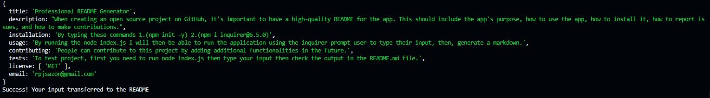

# Professional README Generator

  ## Link:
  https://rpjsazon.github.io/Professional-README-Generator/

  ## License:
  

  ## Description:
  When creating an open source project on GitHub, it's important to have a high-quality README for the app. This should include the app's purpose, how to use the app, how to install it, how to report issues, and how to make contributions.

  ## Table of Contents:
  - [Description](#description)
  - [Installation](#installation)
  - [Usage](#usage)
  - [Contributing](#contributing)
  - [Tests](#tests)
  - [Email](#email)

  ## Installation:
  By typing these commands 1.(npm init -y) 2.(npm i inquirer@6.5.0)

  ## Usage:
  By running the node index.js I will then be able to run the application using the inquirer prompt user to type their input, then, generate a markdown.

  ## Usage:
  By running the node index.js I will then be able to run the application using the inquirer prompt user to type their input, then, generate a markdown.

  ## License:
  MIT

  ## Contributing:
  People can contribute to this project by adding additional functionalities in the future.

  ## Tests:
  To test project, first you need to run node index.js then type your input then check the output in the README.md file.

  ## Email
  If you have any questions about the repo, open an issue or contact me directly at rpjsazon@gmail.com

  ## Sample output entered for above information
  

  